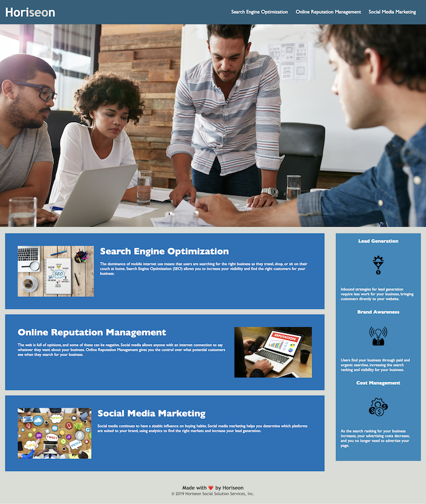

# horiseon-accessibility-refactor

This is an accessiblity refactor of a landing page for a marketing agency, Horiseon.

We wanted to make this page more accessible not only to follow accessiblity standards, but also to make it better optimized for search engines.

## Table of Contents

- [Installation](#installation)
- [Usage](#usage)
- [Credits](#credits)
- [License](#license)

## Installation

N/A

## Usage

This page can be accessed and used on any standard web browser.

## Credits

W3's pages on [semantic HTML](https://www.w3schools.com/html/html5_semantic_elements.asp) and [anchor links](https://www.w3docs.com/snippets/html/how-to-create-an-anchor-link-to-jump-to-a-specific-part-of-a-page.html) were our two main resources used.

## License

Creative Commons License: Our work can be used by others as long as credit is given.

The application can be viewed here: [https://liaobrien.github.io/horiseon-accessibility-refactor/](https://liaobrien.github.io/horiseon-accessibility-refactor/).
